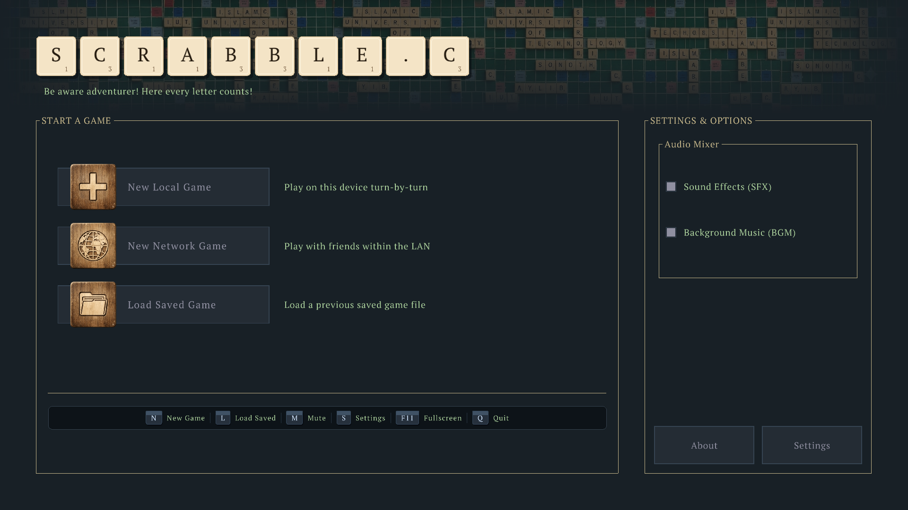
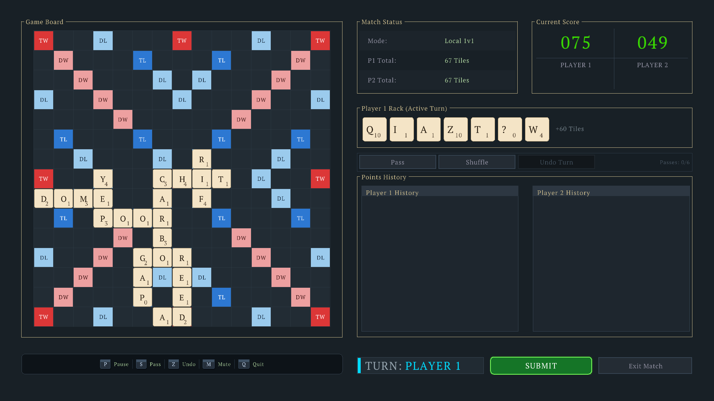

# Scrabble.c

A cross-platform C implementation of Scrabble, built with [raylib](https://www.raylib.com/).

## Screenshots

<p align="center">
  
  <br />
  <em>Main menu</em>
</p>

<p align="center">
  
  <br />
  <em>Match in progress</em>
</p>

## Download

Prebuilt binaries are available on the [latest GitHub Release](https://github.com/sonothamin/Scrabble.c/releases/latest).

Grab the installer or archive for your platform from the **Assets** section. No build tools required.

## Features

- Menu, settings, and audio (SFX & BGM)
- Standard Scrabble game logic with luxury / wildcard tiles
- Local turn-by-turn play, with network play in progress

## Build from source

See [DevEnvironment.md](DevEnvironment.md) for fuller setup notes. Below is the short version per platform.

### Requirements

| Platform | Tools |
| --- | --- |
| Linux | `gcc`/`clang`, `make`, X11/OpenGL/ALSA development packages |
| macOS | Xcode Command Line Tools (`clang`, `make`) |
| Windows | [w64devkit](https://github.com/skeeto/w64devkit/releases) (recommended) or Visual Studio |

Premake and raylib are already vendored under `build/`.

---

### Linux

```bash
# Dependencies (Debian/Ubuntu)
sudo apt update
sudo apt install build-essential \
  libasound2-dev libx11-dev libxrandr-dev libxi-dev \
  libxinerama-dev libxcursor-dev libxkbcommon-dev \
  libgl1-mesa-dev libglu1-mesa-dev

git clone https://github.com/sonothamin/Scrabble.c.git
cd Scrabble.c

# First-time: generate Makefiles
cd build
chmod +x premake5
./premake5 gmake
cd ..

make
./bin/Debug/Scrabble
```

Or use the helper script after Premake has been run once:

```bash
./build_posix.sh
```

Subsequent builds only need `make` from the repo root.

---

### macOS

```bash
xcode-select --install   # if needed

git clone https://github.com/sonothamin/Scrabble.c.git
cd Scrabble.c

cd build
chmod +x premake5.osx
./premake5.osx gmake
cd ..

make
./bin/Debug/Scrabble
```

---

### Windows (MinGW / w64devkit : recommended)

1. Install [w64devkit](https://github.com/skeeto/w64devkit/releases) and add its `bin` folder to your `PATH`.
2. Open a terminal in the repo root and run:

```cmd
build-MinGW-W64.bat
```

That generates Makefiles and builds the game. The executable is at `bin\Debug\Scrabble.exe`.

For later rebuilds:

```cmd
make
```

---

### Windows (Visual Studio)

```cmd
build-VisualStudio2022.bat
```

or

```cmd
build-VisualStudio2026.bat
```

Open the generated solution in Visual Studio and build from there.

---

## Project layout

| Path | Purpose |
| --- | --- |
| `src/` | Game source |
| `include/` | Headers |
| `resources/` | Assets (images, audio, data) |
| `build/` | Premake config and bundled raylib |
| `bin/` | Built executables |

## Contributing

Contributions are welcome. Fork the repo, make your changes, and open a pull request. Bug reports and feature ideas via issues are appreciated too.

## License

See the repository for license details.
